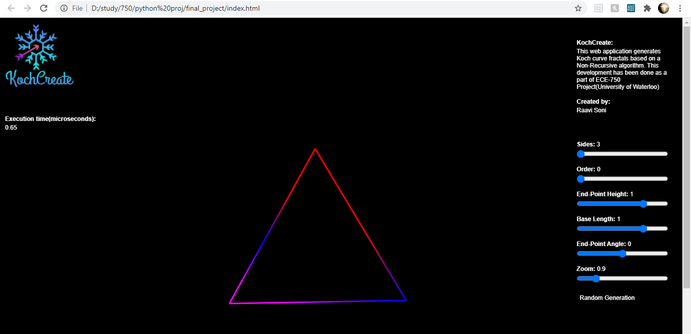
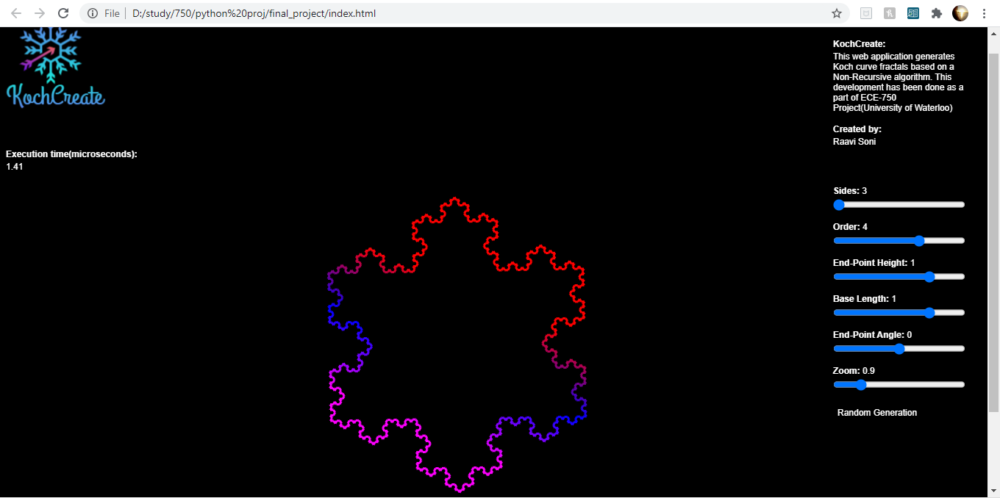
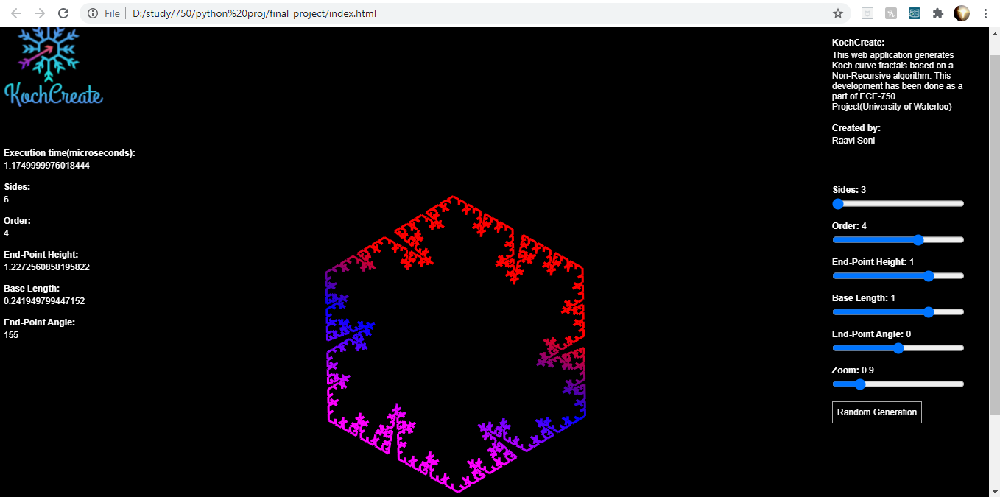
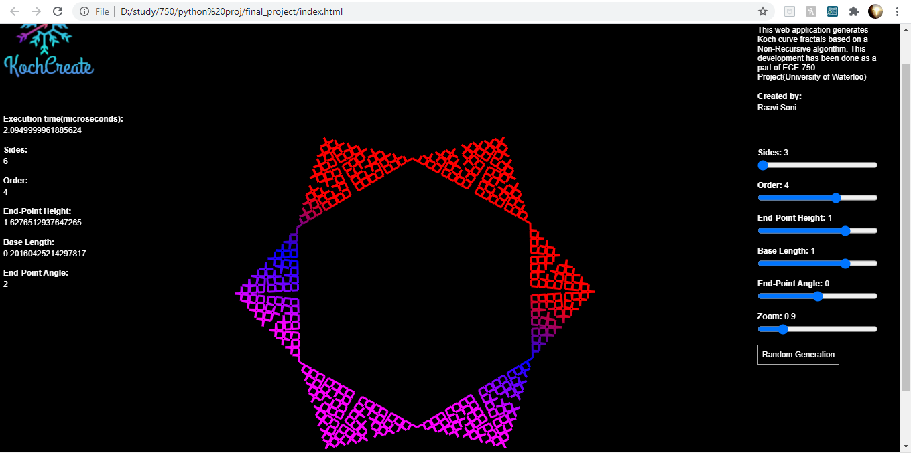
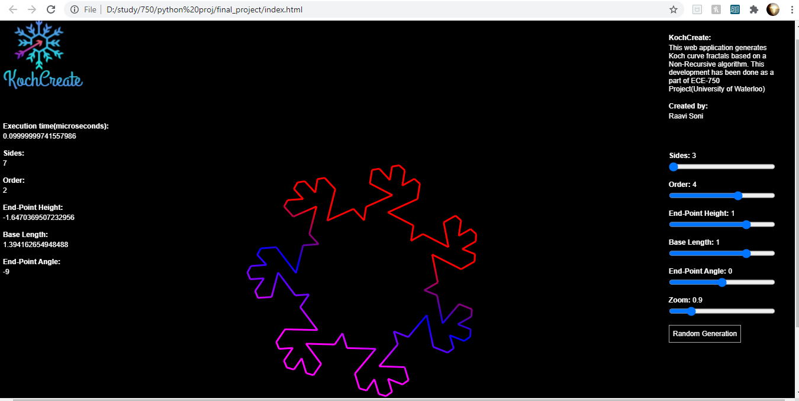

# Non-recursive-fractals
The web application developed named 'KochCreate' creates Koch Fractals using a Non-Recursive algorithm

Steps to execute:

Full code folder can be downloaded.
Download and unzip, Double click on index.html file to execute.

There are 3 code files:

1. index.html
2. dynamic_koch.js
3. panelfile.js

#//panelfile includes a JavaScript library(used from: https://github.com/bit101/quicksettings/blob/master/quicksettings.js)
#//for creating panel to select inputs, the code has been partially modified by me.

Default view of KochCreate"

Koch curve with sides = 3 and order = 4

Variant generated with user inputs

Variants generated with randomly

