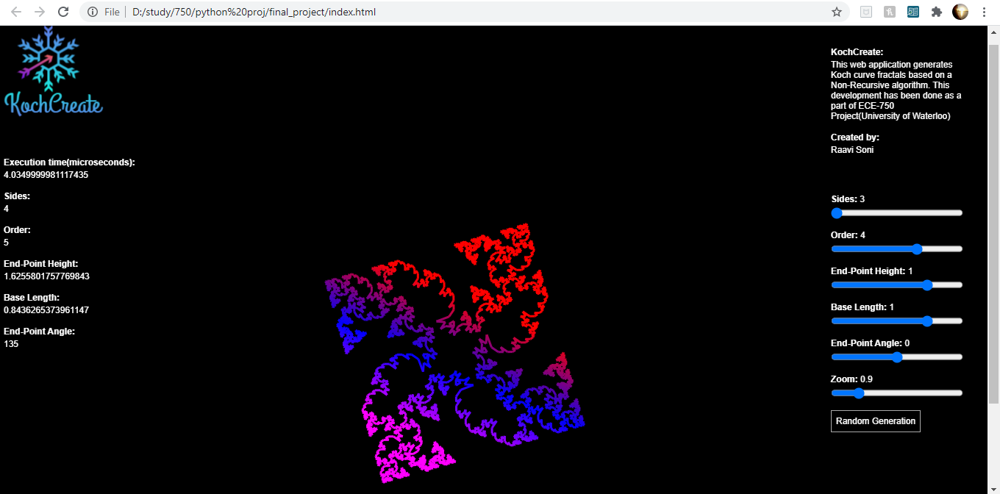

# Non-recursive-fractals
The web application developed named 'KochCreate' creates Koch Fractals using a Non-Recursive algorithm

Steps to execute:

Full code folder can be downloaded.
Download and unzip, Double click on index.html file to execute.

There are 3 code files:

1. index.html
2. dynamic_koch.js
3. panelfile.js

Default view of KochCreate"

Koch curve with sides = 3 and order = 4

Variant generated with user inputs

Variants generated with randomly

